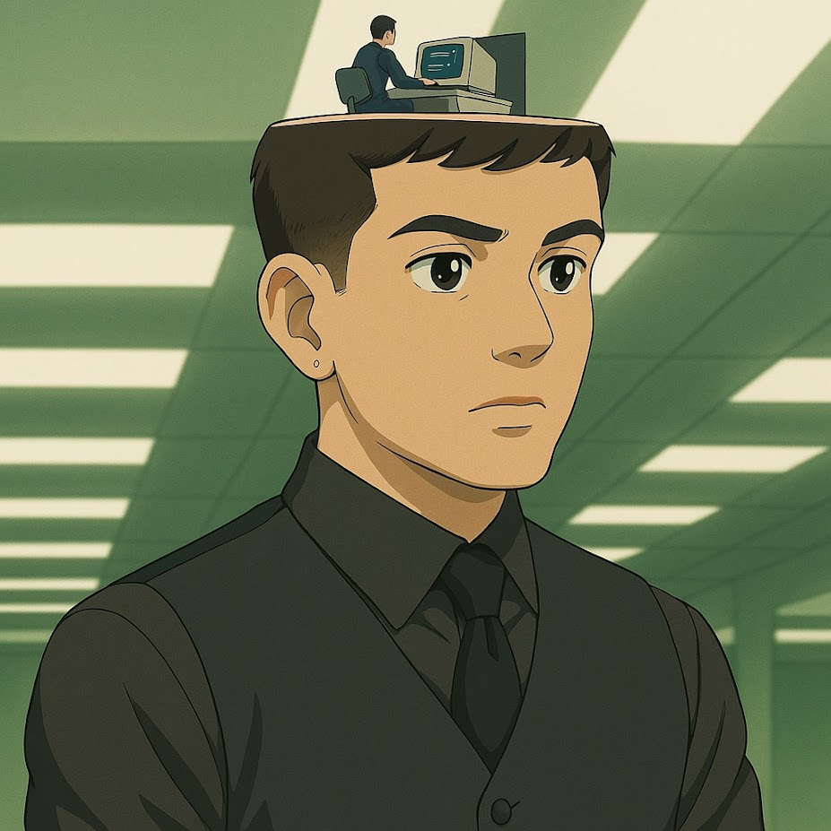

<!-- Banner com saudação -->

<h1 align="center">👋 Hello, I'm Renan!</h1>

O que determina nosso comportamento é o ambiente que estamos inseridos. Estar cercado de pessoas e projetos inspiradores me ajuda a manter o foco, a motivação e a evolução constante. Valorizo o processo tanto quanto o resultado — seja resolvendo um bug teimoso, aprendendo uma nova linguagem ou colaborando em algo desafiador com a equipe.

Acredito em mirar alto, mas com leveza e flexibilidade.

> “Voe alto e seja leve 🎈”

Tenho trabalhado em um sistema SaaS aplicando:
- **Metodologias ágeis**: Scrum e Kanban
- **Foco em qualidade e entregas constantes**

Além da técnica, valorizo **comunicação clara**, **colaboração efetiva**.

---

- 🎓 Bacharel em **Ciência da Computação**
- 💼 Desenvolvedor back-end
- 📈 Práticas ágeis, Clean Code e boas arquiteturas
- 🧪 Curioso, autodidata e sempre em busca de soluções elegantes

---

## 🛠️ Tecnologias que utilizo

### ⚙️ Ferramentas & Boas Práticas

---

## 🌱 Em constante aprendizado

Atualmente focado em:
- Aprimorar arquitetura de APIs REST e microsserviços
- Performance em aplicações back-end
- Boas práticas com testes automatizados

---

## 🌐 Contato

 
> _"Esse sou eu na minha série favorita... Severence"_ 👔🗂️🕝
---

  

 

---

⭐ Obrigado pela visita!
<!-- Sinta-se livre para personalizar ainda mais com projetos em destaque, badges de cursos, certificações etc. -->
